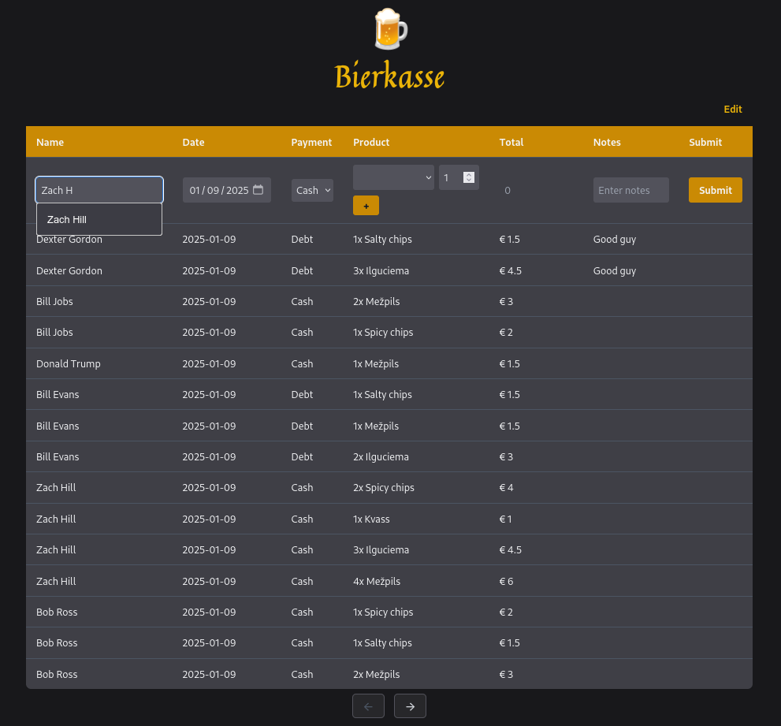

# Bierkasse

Bierkasse is a simple **bookkeeping tool** developed for a student corporation, but I assume it can be used for any simple bookkeeping case. It allows users to add entries to the journal which keeps track of who purchased what, what amount, what date and whether the person has paid for the product or not.

Some other features included are:
* Name autocompletion based on previous entries
* Automatic total calculation
* Admin dashboard for journal and product entry editing
* Ability to export all entries as a .csv files
* Debts page for a fast and convenient way to check the debtors and mark debts as paid

## Todo

### Big tasks
- [ ] **Basic auth for index page**
- [ ] **Russian language**

### Small tasks
- [ ] Ability to delete journal entries
- [ ] Sort debts from biggest to lowest
- [ ] Move js scripts to separate files
- [ ] Better documentation

### Unsure about these
- [ ] Should all routes be protected with middleware?
- [ ] Basic api to work with the journal table

### Done
- [x] Allow renaming products
- [x] Allow same name products with different prices
- [x] Success messages
- [x] Combine save buttons into one at the top
- [x] **Export as csv**
- [x] Add warning to products edit page
- [x] Don't use tailwind cdn
- [x] **Debt page**
- [x] **Name autocomplete**